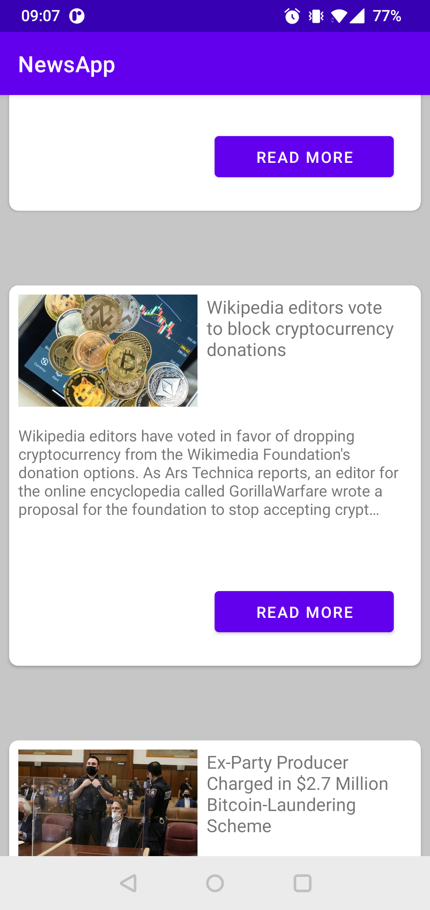

# News Application
Simple application to view the public news published on newsapi.org

## Demo
  

### Google components used in project
* [ViewModel][10]
* [LiveData][15]
* [DataBinding][14]

[10]: https://developer.android.com/topic/libraries/architecture/viewmodel
[14]: https://developer.android.com/topic/libraries/data-binding/
[15]: https://developer.android.com/topic/libraries/architecture/livedata

### Some of 3rd party libs used in project
* [Koin][21]
* [Retrofit][22]
* [OkHttp][23]
* [Coil][25]

[21]: https://github.com/InsertKoinIO/koin
[22]: https://github.com/square/retrofit
[23]: https://github.com/square/okhttp
[24]: https://github.com/Tickaroo/tikxml
[25]: https://github.com/coil-kt/coil

Developed By
------------

* Adam Szkup
